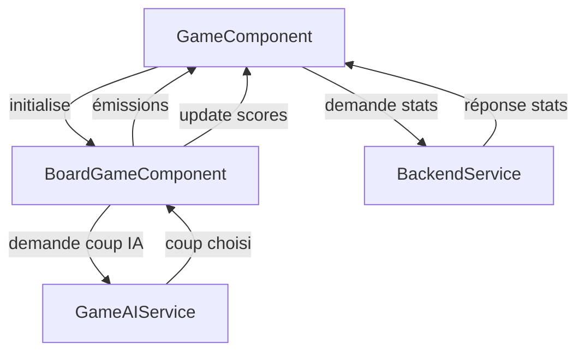

# Othello AI - Frontend

Ce projet est le frontend Angular d'un jeu **Othello** avec intelligence artificielle.  
Il gère l'affichage du plateau, la logique de jeu côté client, la communication avec l'IA et le backend pour les statistiques et le Top 10.

---

## Table des matières

- [Othello AI - Frontend](#othello-ai---frontend)
  - [Table des matières](#table-des-matières)
  - [Installation](#installation)
  - [Structure du projet](#structure-du-projet)
  - [Composants principaux](#composants-principaux)
    - [`GameComponent`](#gamecomponent)
    - [`BoardGameComponent`](#boardgamecomponent)
  - [Services](#services)
    - [`GameLogicService`](#gamelogicservice)
    - [`GameAIService`](#gameaiservice)
    - [`BackendService`](#backendservice)
  - [Flux de données et communication](#flux-de-données-et-communication)
  - [Fonctionnalités](#fonctionnalités)
  - [Commandes utiles](#commandes-utiles)

---

## Installation

1. Cloner le projet :
   ```bash
   git clone <repo-url>
   cd othello-frontend
````

2. Installer les dépendances :

   ```bash
   npm install
   ```
3. Lancer l'application :

   ```bash
   ng serve
   ```

   L'application sera disponible sur `http://localhost:4200`.

---

## Structure du projet

```
src/
 ├─ app/
 │   ├─ boardgame/         # Composant du plateau de jeu
 │   ├─ game/              # Composant principal du jeu
 │   ├─ services/          # Services pour logique, IA et backend
 │   ├─ app.component.*    # Composant racine
 │   └─ app.module.ts      # Module principal
```

---

## Composants principaux

### `GameComponent`

* Composant principal du jeu.
* Gère :

  * Le plateau (`BoardGameComponent`)
  * Les scores et tours (`Joueur` / `IA`)
  * La sélection de difficulté
  * Les panels statistiques et Top 10
  * Les modales de fin de partie

### `BoardGameComponent`

* Composant du plateau de jeu.
* Gère :

  * La grille (`8x8` par défaut)
  * Les clics joueurs et animations de retournement de pions
  * La logique de tours
  * La communication avec l’IA pour les coups automatiques

---

## Services

### `GameLogicService`

* Contient la logique de jeu côté client.
* Gère :

  * Initialisation du plateau
  * Validation des coups
  * Calcul des pions retournés
  * Score actuel et changement de joueur

### `GameAIService`

* Intelligence artificielle du jeu.
* Gère :

  * Choix du coup selon la difficulté
  * Algorithmes :

    * Choix aléatoire (Facile)
    * Minimax avec élagage Alpha-Beta (Moyen, Difficile, Expert)
  * Évaluation des coups selon :

    * Différence de pions
    * Contrôle des coins et bords
    * Mobilité et pénalités pour positions X

### `BackendService`

* Communication avec le backend pour les statistiques.
* Gère :

  * Récupération des stats globales (`/api/stats`)
  * Mise à jour du Top 10 (`/api/stats/update`)
  * Observable `statsLoaded$` pour notifier le frontend

---

## Flux de données et communication



**Explication :**

1. `GameComponent` initialise le plateau via `BoardGameComponent`.
2. `BoardGameComponent` gère les clics et envoie les changements de tour et score à `GameComponent`.
3. `GameComponent` consulte `BackendService` pour afficher les statistiques et le Top 10.
4. L'IA est sollicitée via `GameAIService` pour jouer automatiquement les tours de l'IA.
5. Tous les changements sont renvoyés au `GameComponent` pour mettre à jour l’interface utilisateur.

---

## Fonctionnalités

* Plateau de jeu Othello (`8x8`)
* Choix de difficulté : Facile, Moyen, Difficile, Expert
* IA avec comportement progressif selon la difficulté
* Affichage des scores en temps réel
* Affichage des coups valides
* Panel statistique avec Top 10
* Enregistrement du Top 10 dans le backend
* Modales de fin de partie avec options Rejouer / Menu / Changer difficulté
* Animations de retournement des pions
* Possibilité de passer son tour

---

## Commandes utiles

```bash
ng serve              # Lancer le serveur de développement
ng build              # Compiler pour la production
ng test               # Lancer les tests unitaires
ng lint               # Vérifier le style et la qualité du code
```

*Ce projet a été développé en Angular 17 avec TypeScript et RxJS.*


